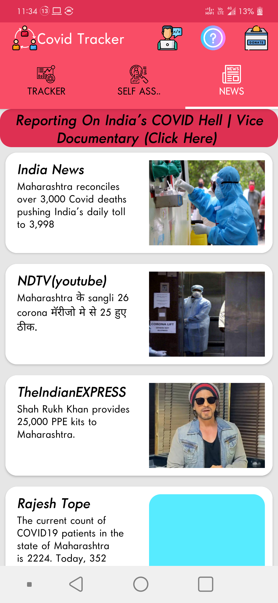
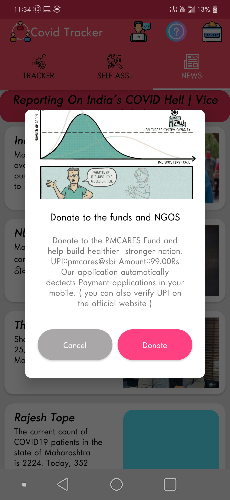
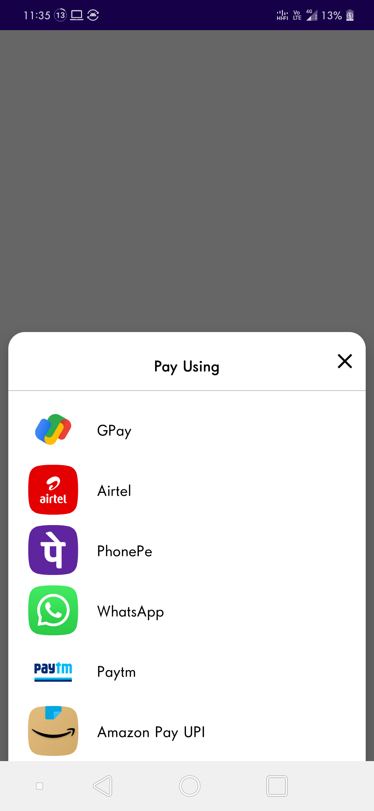
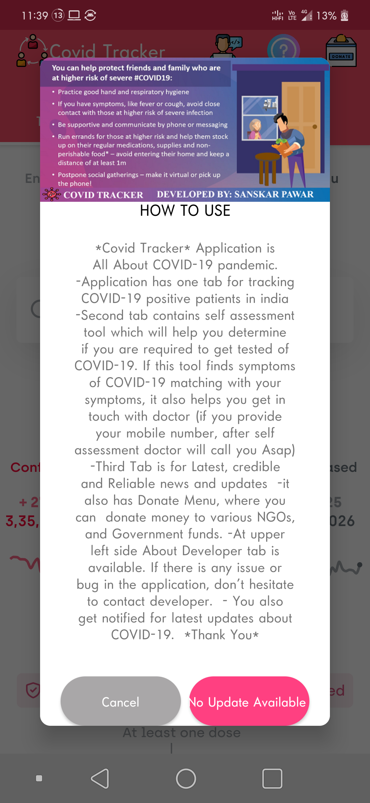
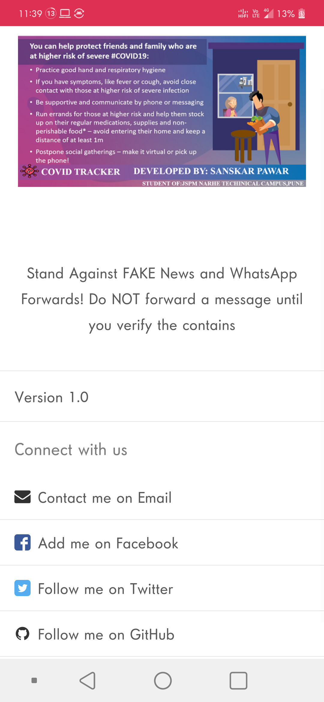

	

		

         
		
	
	
	

    
# Covid Tracker

This is a project developed to help people in getting updates on Covid19 statistics and related latest news. This app also helps to take a self-assessment test for Covid19. We can also make donations with this app to PM Cares Fund. 

## Tech Stack

**IDE:** Android Studio

**Languges Used:** Java,XML

**Database:** Firebase

## APK
  [Download APK](https://github.com/sanskarpawar/CovidTracker_SelfAssesment_Firebase/raw/master/Screenshots/Covid_Tracker.apk)
  
#### Some Screenshots of this app

 Tracker Tab                               | Self Assesment                                        | News Tab 			                    | Donate Menu 
:------------------------------------------:|:-------------------------------------------:|:-----------------------------------------------:|:----------------------------------------:
  |   ||

 UPI Apps PopUp                           | How To Menu                             | About Dev. Menu                       |
:-----------------------------------------:|:--------------------------------------------:|:-----------------------------------------------:|
 | ||
 

 ## Real-Time Database

 
 
## License

[MIT](https://choosealicense.com/licenses/mit/)

## Support

For support, email pawarsanskar50@gmail.com 
 
 
 
 
 
 
 
 
 
 
 
 
 
 
 
 
